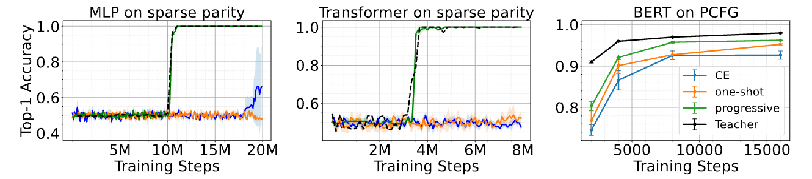
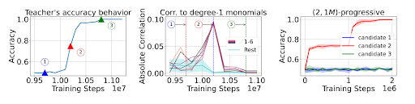
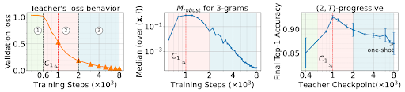
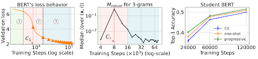

## Progressive distillation induces an implicit curriculum

This repository contains the code for our paper [Progressive distillation induces an implicit curriculum](https://openreview.net/forum?id=wPMRwmytZe). It has been accepted for oral presentation at [ICLR 2025](https://iclr.cc/).

## Quick Links

- [Overview](#overview)
- [Main Results](#main-results)
- [Experiments](#experiments)
- [Bugs or Questions?](#bugs-or-questions)
- [Citation](#citation)

## Overview

Knowledge distillation leverages a teacher model to improve the training of a student model. A persistent challenge is that a better teacher does not always yield a better student, to which a common mitigation is to use additional supervision from several “intermediate” teachers. One empirically validated variant of this principle is progressive distillation, where the student learns from successive intermediate checkpoints of the teacher. This work studies progressive distillation across multiple synthetic and real-world settings, and identifies an implicit curriculum that helps smaller models to learn faster.

## Main Results

We compare 3 strategies for training a student model: cross entropy (CE) training from data, one-shot distillation using the final teacher checkpoint, and progressive distillation which additionally uses intermediate checkpoints. Across three settings, (a) MLPs and Transformers on sparse parity, (b) Transformers on PCFG, and (c) BERT on Wikipedia+Books, we show progressive distillation helps a smaller student learn faster than one-shot distillation and cross entropy training.



Next, we study the reason why progressive distillation might be helping the student model to learn faster. We identify (theoretically and empirically) that intermediate checkpoints constitute a curriculum by providing easier-to-learn signals to the student. Among various checkpoint choices, those during sharp loss transitions prove to be the most effective. For sparse parity, the implicit curriculum manifests as a spike in the correlations to low-degree monomials of in-support variables, which occurs during a phase transition period of the accuracy. The implicit curriculum provably reduces the sample complexity and empirically allows the student to learn as fast as a larger teacher (wider MLP, or Transformer with more attention heads). Moreover, 1 checkpoint from the phase transition suffices to accelerate the student.



Similar observations extend to PCFG and natural languages, where models are trained for masked prediction. Progressive distillation helps the student learn structures of the data, as measured by dependencies on n-grams and accuracy of PCFG non-terminal prediction. For PCFG, the teacher model exhibits 3 phases in the loss. The 2nd one resembles the phase transition in parity, during which the teacher provides an implicit curriculum via increased dependency on easy-to-learn short n-grams, and checkpoint in the middle of the phase transition is the most helpful.



We show similar results for natural languages (Wikipedia+Books), where n-gram curriculum arises during the period of sharp loss drop, and progressive distillation helps accelerate training.




## Experiments

We provide 3 main folders to reproduce the following 3 sets of experiments:

- MLPs on parity ([Link](parity_mlp))
- BERT on PCFG ([Link](PCFG_mlm))
- GPT2 on PCFG ([Link](PCFG_autoregressive))

Each folder contains detailed instructions on how to run the experiments. Please refer to them.


## Bugs or Questions?

If you have any questions related to the code or the paper, feel free to email Abhishek (ap34 'at' princeton 'dot' edu), and Bingbin (claraliubb 'at' gmail 'dot' com). If you encounter any problems when using the code, or want to report a bug, you can open an issue. Please try to specify the problem with details so we can give more effective help!

## Citation

Please cite our paper if you find our paper or this repo helpful:
```bibtex
@inproceedings{panigrahi2025progressive,
title={Progressive distillation induces an implicit curriculum},
author={Abhishek Panigrahi and Bingbin Liu and Sadhika Malladi and Andrej Risteski and Surbhi Goel},
booktitle={The Thirteenth International Conference on Learning Representations},
year={2025},
url={https://openreview.net/forum?id=wPMRwmytZe}
}
```
